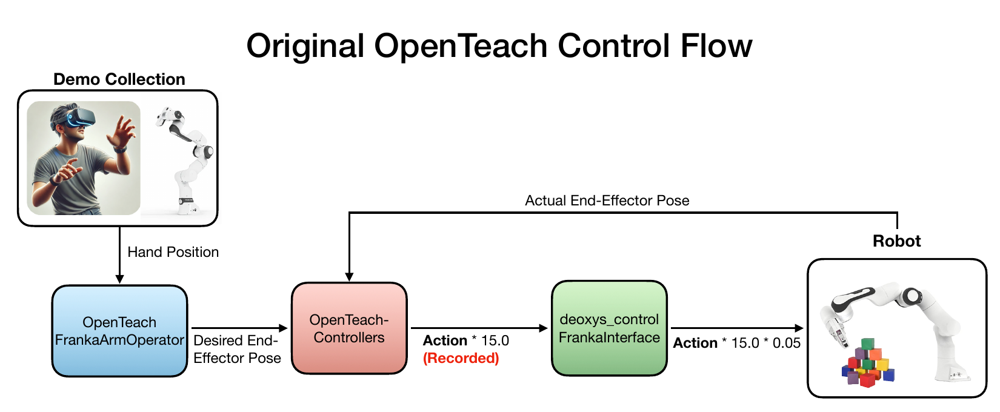
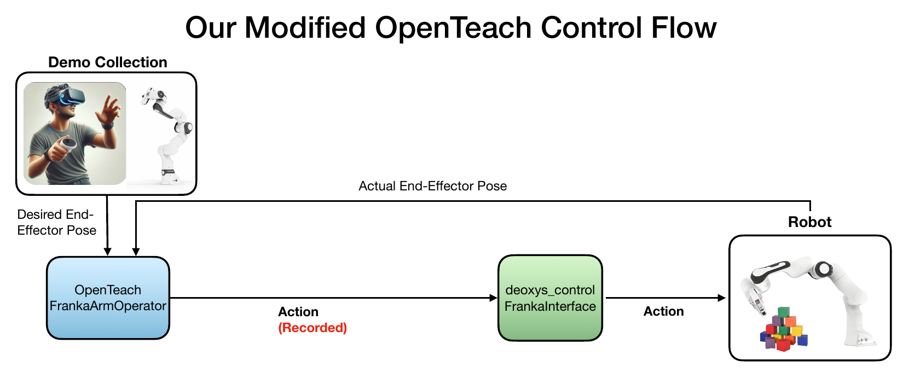

# OPEN TEACH for Quest 3 Controller Teleoperation

#### Fork authors: [Jeremiah Coholich](https://www.jeremiahcoholich.com/) and [Justin Wit](https://www.linkedin.com/in/justin-wit/)
Original OPEN TEACH Authors: Aadhithya Iyer, Zhuoran Peng, Yinlong Dai, Irmak Guzey, Siddhant Haldar, Soumith Chintala, Lerrel Pinto
[OPEN TEACH Paper](https://arxiv.org/abs/2403.07870)
[OPEN TEACH Website](https://open-teach.github.io/)

This OPEN TEACH fork simplifies the software stack and enables teleoperation with the Quest 3 controller instead of hand tracking. We have only used this code for teleoperating a Franka Emika Panda arm with the Franka gripper in the real world with a Meta Quest 3.

Below are videos showing a user teleoperating the robot and a visualization of recorded demonstration data.

[](https://youtu.be/IGMm5zwZs3o) [](https://youtu.be/8bc508QxUwo)

<sub>(Click an image to watch the video — hold Ctrl/Cmd to open in a new tab)</sub>


## Summary of Changes

<!-- Add image before.png -->



Previously, we found that using the Meta Quest's hand tracker for teleoperation added noise and jitter and was not necessary for teleoperating an arm without a dexterous hand. Also, we found it difficult to make successful grasps, since the "pinch" movement to teleoperate a grasp interfered with the hand tracking, meaning that the end-effector would drift during grasp attempts.

Our changes/additions to OPEN TEACH include:
- Teleoperation with the Meta Quest 3 controller (much smoother)
- Grasp actuation with the controller trigger
- A stop/resume button to allow the user to reposition their hand during teleoperation
- A new apk file without the camera streaming window, which we often found blocking our pass-through view of the robot during teleoperation
- A simplified software stack. **We removed the requirement for ROS and the OpenTeach-Controllers repository entirely.** Many of our changes and additions can be found in the file [`openteach/components/operators/franka.py`](openteach/components/operators/franka.py)
- Code for saving and post-processing robot demo data

This repo consists of two parts:
- Updated OPEN TEACH code
- An updated .apk VR application file


## Code Installation
Install [Deoxys Control](https://github.com/UT-Austin-RPL/deoxys_control).

Clone this repository and enable pre-commit hooks:
```bash
GIT_LFS_SKIP_SMUDGE=1 git clone git@github.com:jmcoholich/openteach.git
git config core.hooksPath .githooks
```

Create the conda environment:
```bash
conda env create -f environment.yml
```
(We highly recommend using [mamba](https://github.com/mamba-org/mamba) instead of conda for faster environment creation.)

This code has only been tested on Ubuntu 20.04

<!-- This is the official implementation of the Open Teach including unity scripts for the VR application, teleoperation pipeline and demonstration collection pipeline.

Open Teach consists of two parts.

- [x] Teleoperation using Meta Quest 3 and data collection over a range of robot morphologies and simulation environments.

- [x] Policy training for various dexterous manipulation tasks across different robots and simulations. -->

## VR Installation and User Interface

#### Installation
This can be done in two ways.

##### 1. Install Our APK

You can install the application directly into your Quest using the [APK file](VR/APK/FrankaRemoteTrackingV2.apk) we provide using [SideQuest](https://sidequestvr.com/).

##### 2. Build from Source

* To provide more flexibility and allow customization of the VR APK, we’ve also released its source code. The APK was developed in Unity 2021.3.5f1. We recommend using this version to ensure error-free builds.
* For building the apk from source , add the [VR code files](/VR/Franka-Bot-Unity/) to Unity and within the settings in File menu select Build and Run. The targeted device in Build settings should be the Quest you are connecting to. Users will also need a Meta account with Meta Quest Developer Hub with developer mode enabled.


#### User Interface for Franka Arm + Franka Gripper:
After you install the APK file, launch the app on the headset. You will be prompted with a pink controller and a menu button. If you do not see a laser pointer from the remote click **B**. Click the Menu button then click on 'Change IP Address' and enter the IP using the dropdown (use the trigger button to scroll). The VR and the Robot should be under the same network provider. Once the IP is entered click 'Change' and then click 'Stream'. The remote will become red and your app is ready to stream the controller position data.

#### Note: Remember to enter your same IP on the server host address variable [config](/configs/network.yaml)


 Mode                  | Remote Indicator |
| -------------------- | ---------------------- |
| Network Config       | Pink                   |
| Teleoperate          | Green                  |
| Pause                | Red                    |


Our app only requires the right-hand controller. Use the **B** button to pause and resume teloperation. When resuming, the system reinitializes the origin, allowing you to resume teleoperation from a new hand position. Use the trigger button to operate to toggle the gripper state (open/closed).

## Running Teleoperation

The script `teleoperate.bash` uses [xdotool](https://github.com/jordansissel/xdotool) to start all scripts automatically in a GNOME [Terminator](https://gnome-terminator.org/) window. Please wait for the script to finish once started; if other keyboard or mouse commands are given before the script is finished, it may fail. To run the automated script:

```bash
bash teleoperate.bash <NUC_IP_ADDR>
```
### To start teleoperation step-by-step:
Run this on the NUC:

```bash
cd deoxys_control/deoxys && ./auto_scripts/auto_arm.sh config/charmander.yml
```

In another NUC terminal run:
```bash
cd deoxys_control/deoxys && ./auto_scripts/auto_gripper.sh config/charmander.yml
```

#### On the main workstation, run each of the following sets of commands in a new terminal:

Reset the robot joints to a default position:
```bash
conda activate openteach && cd ~/deoxys_control/deoxys/examples
python reset_robot_joints.py
```

Start streaming the cameras:
```bash
conda activate openteach && cd ~/openteach
python robot_camera.py
```

Start camera recordings:
```bash
conda activate openteach && cd ~/openteach
python data_collect.py robot=franka demo_num=<name for demo>
```

Start robot teleoperation:
```bash
conda activate openteach && cd ~/openteach
python teleop.py robot=franka record=<SAME demo name as in previous command>
```

To end teleop and save the recordings, simply kill the above two scripts. To reset the arm, run:

```bash
cd ~/deoxys_control/deoxys/examples
python reset_robot_joints.py
cd ~/openteach
python reset_gripper.py
```
## Data files
After stopping the `teleop.py` script, a file named `deoxys_obs_cmd_history_<demo name>.pkl` will be saved in `openteach/extracted_data`. This pkl file will contain all robot states and observations (no camera inputs) and actions recorded by `openteach/openteach/components/operators/franka.py`.

After stopping the `data_collect.py` script, a folder named `demonstration_<demo name>` will be saved in the same folder. This folder contains the RGBD camera recordings.

To post-process the data, run:

```bash
python visualize_demo.py --demo_number <demo name>
```

This script will combine the camera observations and robot actions/proprioception into a single .pkl file at `openteach/extracted_data/demonstration_<demo name>/demo_<demo name>.pkl`. Additionally, the script will save a video of the demo at `openteach/extracted_data/demonstration_<demo name>/demo_<demo name>.mp4`, like the one seen at the top of this README.


<!-- ### Policy Learning

For open-source code of the policies we trained on the robots refer [here](/docs/policy_learning.md)

### Policy Learning API

For using the API we use for policy learning, use [this](https://github.com/NYU-robot-learning/Open-Teach-API)

### Call for contributions

For adding your own robot and simulation refer [here](/docs/add_your_own_robot.md) -->

### Citation
Citation for the original OPEN TEACH paper:
```
@misc{iyer2024open,
      title={OPEN TEACH: A Versatile Teleoperation System for Robotic Manipulation},
      author={Aadhithya Iyer and Zhuoran Peng and Yinlong Dai and Irmak Guzey and Siddhant Haldar and Soumith Chintala and Lerrel Pinto},
      year={2024},
      eprint={2403.07870},
      archivePrefix={arXiv},
      primaryClass={cs.RO}
}
```

## License
This project is licensed under the MIT License.

- Original code © 2024 Aadhithya Iyer
- Fork and modifications © 2025 Jeremiah Coholich and Justin Wit

See the [LICENSE](./LICENSE) file for full terms.

